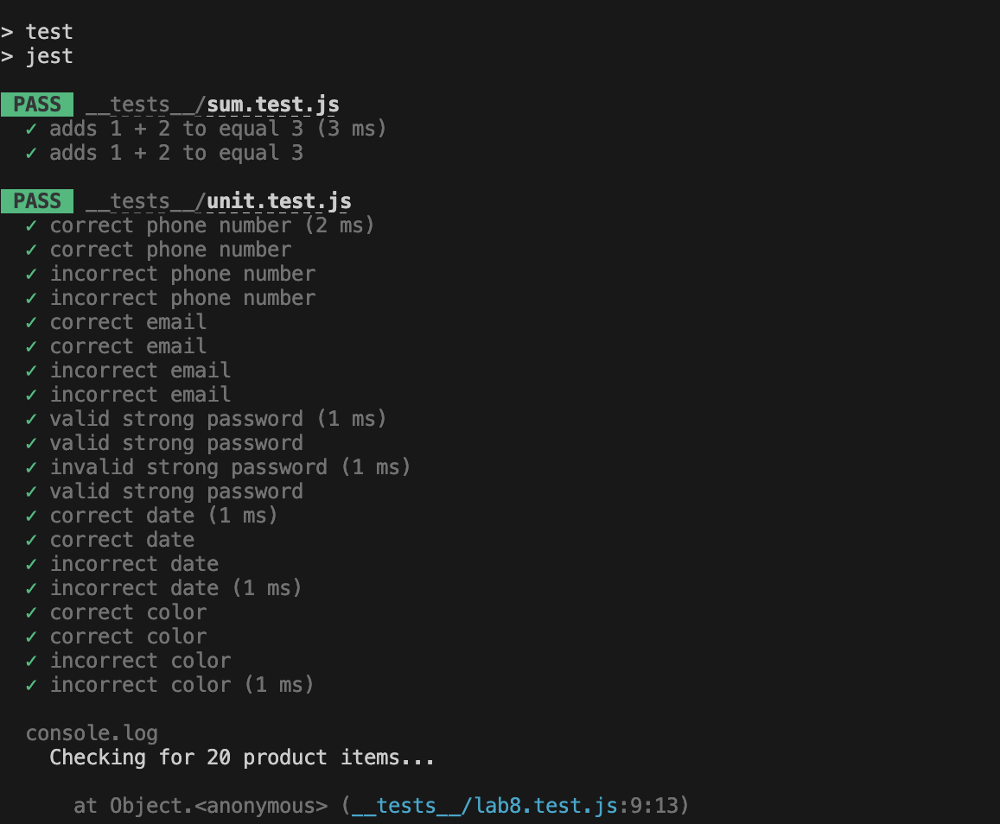
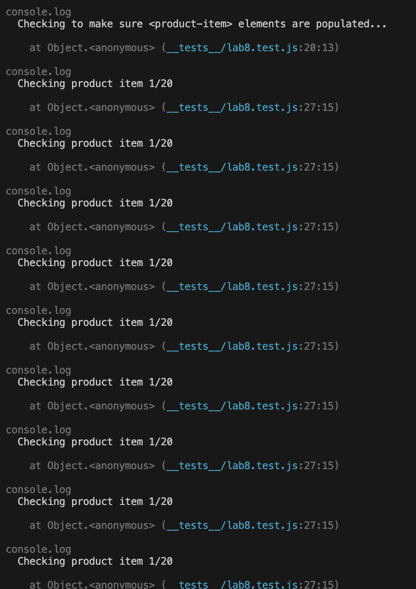
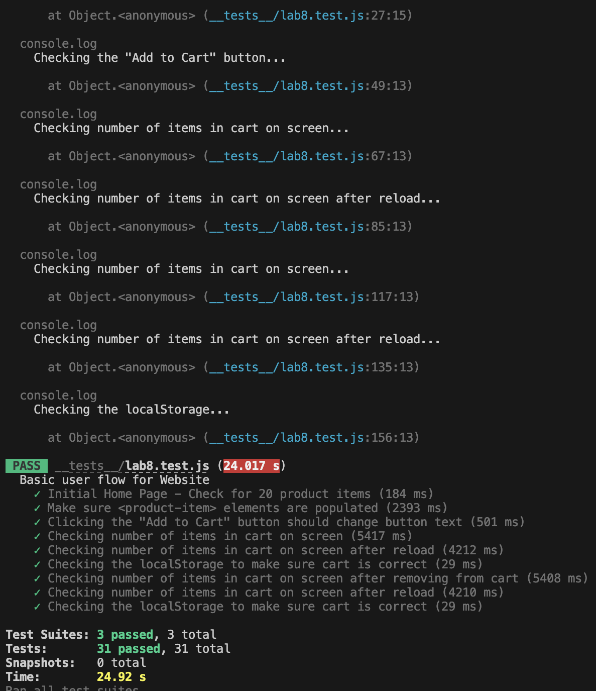

# Lab 8 - Starter
1. I will choose 2, since we can munually run the code very easily with go live functionality in the VScode, whereas the other two will takes more time, and not very intuitive to debug. 

2. No, we can just check the output instead of emulate user actions.

3. No, since the message feature is better to tested with emulating user actions, instead of just check the part.

4. Yes, because their is a definite result and clear scope of what we want, so we can use unit test.

